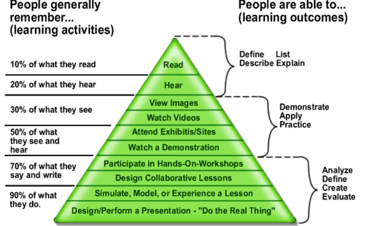

# MEMO.

* 信息安全领域是庞大的体系，你无法了解一切
* 你确实需要花上一段时间学习不同的技术原理/结构/过程，但不是7年或是更久
* 遵循RDTennent最初定义的相同原则：（触类旁通相似的知识点）
  1. 抽象原理
  2. 对应原理
  3. 数据类型完整性原则
* 请快速学习各种技术的原理/结构/过程！！！
* 通过社区进行学习，从别人那学习和提高技能
* 在社区里会遇到各种人，不要沮丧，保持友好和尊重
* 信息安全领域包含海量的知识点，找到自己最擅长的主题，建立自己的技术栈，不断优化和提升
* 在Internet上查找资源——快速学习——使之适用于正在使用的环境
* 动手练习，动手练习，动手练习
* 必须学会如何“学习/寻找/选择/改编”我们需要的信息
* 尝试使用多种方法去解决问题
* 欢迎使用黑客的思维方式： \*\*`Outside the box`\*\*跳出已形成的刻板的思维框架
* 在渗透测试期间，由于必须专注于太多的技术方面的内容，以至于当你不了解某些技术时，会感到非常的沮丧和困惑

  > **A problem is an emotional state. Without emotions, it is just a situation.（问题是一种情绪状态。没有了情绪，就仅仅是一种状态）**

* 挫折和困惑会一直伴随着你整个学习过程，所以你的学习进度和过程很大程度取决于你的情绪状态，请控制好它
* \*\*know your goal：\*\*一定要清楚自己的目标，这样在遇到障碍时才不会迷失
  * 首先，您必须找出所需的信息。
    1. `**What do you already know?**`
    2. `**What do you not known yet?**`
  * 然后，处理你所找到的大量信息，并使其成为适用你当前的工作环境中
* 失败，是学习过程中无法避免和不可或缺的一个环节。不要害怕它，通过失败来建立属于自己的经验
* 什么程度才能叫“好”？
  1. 擅长做某件事，意味着你知道自己在做什么
  2. 如果你知道自己在做什么，就意味着你已经有足够的经验应用于对应的这个领域了
* 关于练习时长：
  1. 遵循二八原则：前20小时学习一项新知识，后80小时练习
  2. 一个策略通常不会适用于所有学习场景，根据实际内容去调整，结合不同的方法学习新的东西
* Learning Pyramid\(学习金字塔\)：通过讨论/解释/传授，可以一次掌握更多的知识内容

     

* 寻找有质量的信息，因为并非所有信息都有用。过多的无用信息可能会使你对新知识更困惑和迷茫：**紧跟实际的工作环境的上下文来查找信息**
* 不断的成功，是保持动力最有效的办法。

  > **Progress is noticeable when the question that tortured you has lost its meaning.（当折磨你的问题失去意义时，进步是显而易见的。）**

* 回顾过去，看看自己走了多远，将使您充满动力。许多人在学习过程中会感到挣扎，因为他们必须学习很多不同的主题：**休息并保持镇定至关重要**。
* 至关重要的是要注意细节。我们所有的知识和经验都是建立在联想的基础上的，这些联想通过不同的情况（如记忆）将我们与不同的感知（例如颜色和气味）联系起来。这些将在以后主动或被动地被召回。
* 请使用容易让报告的目标对象理解的方式进行文档编写。内容全面/结构清晰/避免重复和起义/尽可能的简单
* 创建一个列表，列出各种不同的管理技术和方法，以查找其所有弊端和优点，并尝试最适合自己的管理方法和方法，为自己选择/创建方法。
* 当焦点转移到实际压力之外时，就放开了那些给我们带来极大压力的情况。**运动/睡眠**
* 专注的人不仅具有极大的持久性和顽强性，而且也几乎不会分心或灰心。如果我们知道我们的目标，则更容易相应地调整我们的重点。反过来，这使我们更有效率，而且我们更快地更接近目标，并且不会让自己被外界影响分散注意力

  > **Focusing is the purposeful and deliberate alignment to a specific goal（聚焦是有目的的和有意的对一个特定目标的调整）**

* 注意力是对具有较高兴趣水平的特定主题的感知，以便从中收集特定数据和信息。注意力会随着你获得的经验以及从内容及其清晰度中获得的信息而改变

  > **Attention is influenced by your interests, needs, personal attitudes, beliefs, orientations, goals, and experiences.（注意力会受到你的兴趣、需要、个人态度、信仰、取向、目标和经历的影响）**

* 在某个时候，您的注意力将开始减少，并且您将不再能够有效地吸收信息。在这一点上陷入困境并强迫自己继续尝试和学习，通常会导致理解上的问题，因此带来更大的挫折。**找出注意力持续多长时间以及在哪种情绪状态下持续时间最长，将是一个巨大的优势。**

  > **Make sure that you feel comfortable and ready to learn new things.**

* 认知表现与压力/神经紧张程度之间的关系：

  

  1. Comfort是一个人emotional state的思想，它对行为，思维，专注力，注意力和专心能力有很大影响。这就是**舒适感和无风险行为的态度所带来的幸福感**。
  2. 在舒适度上，很大程度上取决于我们是否处于健康的压力水平或是否已经超过导致性能下降的极限
  3. 当离开所谓的时comfort zone，进入的情况或领域我们经验很少或没有经验。这种不确定性降低了我们的思考能力，并对我们的思维过程产生了强大的影响，进而减慢了我们的步伐。
  4. 小孩没有这种不确定性：They love to try out something new all the time and are not afraid or uncertain of making mistakes.

     > **mistakes are an essential part of the learning process.\(犯错是学习过程中不可或缺的一个环节\)**

  

* 选择离开舒适区的人到达目的地的速度会比他们想象的要快。
* 沮丧是对事件，情况或状况的情感反应，以失望或无能为力的形式发生。通常，这种感觉会根据期望或期望而以不同的强度发生。
* 通常由两类因素引起挫败感：

  1. 外部阻力因素
  2. 内心的挫折感

  

* 在信息安全领域，将不得不处理各种不同的服务/资源/技术，以了解如何获取所需的信息。缺乏资源的沮丧感取决于你的技能。如果你没有必要的技能，会感到不安，这使我们回到了舒适和舒适区这一主题。现在，您还应该能够更好地理解各个主题之间的联系，学会回到挫折容忍的水平。
* 有意识的，但是可控的将自己置身于可能会感到沮丧的情况之下（必须以**可控的**和**有意识的**方式进行，对付即将来临的情况，这必须是你的自觉决定）
* 不要忘记，**挫败感都是暂时的，它终究是会过去的。没有必要对这种感觉感到恐慌，请积极面对它的存在！挫败感过去后，就会留下你获得的经验。**
* 随着时间的流逝，您在应对和应对这种压力大的情况时会变得更加镇定，这反过来会增强您的自信心。您可以控制自己的内心沮丧。但是，几乎无法控制外部因素的挫败感。
* 学习进度：（将过去和现在的知识量进行比较，并试图跟踪进展情况，以便使自己确认我们已经取得了新的成就）
* 每天的进步仅将性能提高1％，结果会产生巨大的差异
* 以书面方式记录进度以回头看看已经走了多远，可以创建两个列表：
  1. 清单1：\*\*在第一个列表上，将自己会的所有技能写下，当前日期以及所有关于所需主题的知识，估计范围为1-10。尝试使其尽可能详细。它越详细，区别就越清晰，以便以后查看。一旦您认为此列表已准备就绪，请将其放下或保存，以使您即使在一年后也可以使用它。
  2. 清单2：\*\*第二个列表是连续写入的。这意味着一旦您熟悉了某个主题并为自己学习了一些新知识，就可以将其添加到此列表中。尝试每天学习，即使只花10分钟。如果您想更科学地进行操作以获得更好的结果，请记录日历周。

